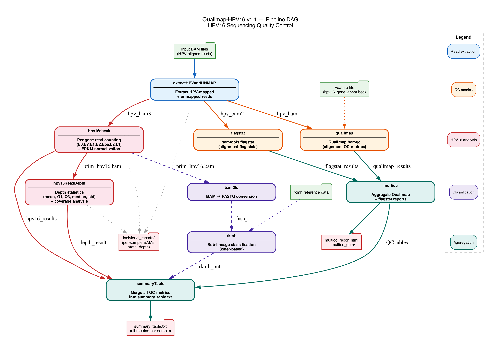

# Qualimap-HPV16

A Nextflow pipeline for comprehensive quality control of HPV16 sequencing data, combining Qualimap, MultiQC, samtools flagstat, per-gene read counting, depth statistics, and rkmh-based HPV16 sub-lineage classification.

## Overview

This pipeline takes BAM files containing reads aligned to HPV reference genomes and performs multi-layered quality assessment specifically designed for HPV16 sequencing studies.

### Pipeline DAG



### Pipeline Workflow

```
Input BAMs
    │
    ▼
extractHPVandUNMAP ──── Extract HPV-mapped + unmapped reads
    │
    ├──► qualimap ──────── Qualimap bamqc (alignment QC metrics) ──┐
    │                                                               │
    ├──► flagstat ──────── samtools flagstat (alignment flags)  ────┤
    │                                                               ├──► multiqc ──► summaryTable
    └──► hpv16check ────── HPV16 gene-level read counting          │        │
           │                 (E6, E7, E1, E2, E5a, L2, L1)         │        │
           │                 + FPKM-like normalization              │        │
           │                                                        │        │
           ├──► bam2fq ──► rkmh ── Sub-lineage classification ─────┘        │
           │                                                                 │
           └──► hpv16ReadDepth ── Depth statistics (mean, Q1, Q3, etc.) ────┘
                                                                             │
                                                                             ▼
                                                                      summary_table.txt
```

### Processes

| Process | Description |
|---------|-------------|
| `extractHPVandUNMAP` | Extracts HPV-mapped and unmapped reads from input BAMs (removes human reads) |
| `qualimap` | Runs Qualimap bamqc for alignment quality metrics |
| `flagstat` | Runs samtools flagstat for alignment flag statistics |
| `hpv16check` | Counts reads per HPV16 gene region (E6, E7, E1, E2, E5a, L2, L1) with FPKM-like normalization |
| `bam2fq` | Converts HPV16 primary BAM to FASTQ for rkmh input |
| `rkmh` | HPV16 sub-lineage classification using rkmh kmer-based method |
| `hpv16ReadDepth` | Calculates read depth statistics (mean, Q1, Q3, median, std) |
| `multiqc` | Aggregates Qualimap and flagstat results into a MultiQC report |
| `summaryTable` | Merges all QC metrics into a single comprehensive summary table |

## Requirements

### Software

- [Nextflow](https://www.nextflow.io/) (version 22.10.x, DSL1)
- [SAMtools](http://www.htslib.org/)
- [Qualimap](http://qualimap.conesalab.org/)
- [MultiQC](https://multiqc.info/)
- [rkmh](https://github.com/edawson/rkmh) (for sub-lineage classification)
- [datamash](https://www.gnu.org/software/datamash/) (for depth summary statistics)
- [bc](https://www.gnu.org/software/bc/) (for FPKM calculations)
- Perl (for bam_coverage.pl)

### Input Data

BAM files aligned to a combined reference containing HPV type references with NCBI-style headers (e.g., `gi|333031|lcl|HPV16REF.1|`).

## Installation

```bash
git clone https://github.com/asangphukieo/Qualimap-HPV16.git
cd Qualimap-HPV16
```

## Usage

### Basic Run

```bash
nextflow run Qualimap.nf \
    --input_folder /path/to/bam_files/ \
    --output_folder ./01_QC \
    --cpu 2 \
    --mem 40
```

### Full Run with All Options

```bash
nextflow run Qualimap.nf \
    --input_folder /path/to/bam_files/ \
    --feature_file hpv16_gene_annot.bed \
    --output_folder ./01_QC \
    --script_folder ./scripts/ \
    --ref_folder ./reference/ \
    --rkmh_data_folder ./data_rmA5 \
    --cpu 2 \
    --mem 40 \
    -resume
```

### Parameters

| Parameter | Required | Default | Description |
|-----------|----------|---------|-------------|
| `--input_folder` | **Yes** | - | Folder containing input BAM files (must end with `/`) |
| `--output_folder` | No | `.` | Output directory |
| `--feature_file` | No | `NO_FILE` | Qualimap feature file (BED) for coverage analysis |
| `--output_format` | No | `html` | Qualimap output format (`html` or `pdf`) |
| `--multiqc_config` | No | `NO_FILE` | MultiQC config YAML file |
| `--script_folder` | No | - | Path to helper scripts directory |
| `--ref_folder` | No | - | Path to HPV16 reference genome directory |
| `--rkmh_data_folder` | No | - | Path to rkmh reference data directory |
| `--cpu` | No | `1` | Number of CPUs per process |
| `--mem` | No | `40` | Memory in GB per process |
| `--help` | No | - | Show help message |

### Input File Format

**BAM files**: Input BAMs should be aligned to a reference containing HPV type sequences with NCBI-style headers. The pipeline identifies HPV reads via the `gi` prefix in reference names.

**Feature file** (optional, BED format):
```
gi|333031|lcl|HPV16REF.1|    104    559    E6
gi|333031|lcl|HPV16REF.1|    562    858    E7
gi|333031|lcl|HPV16REF.1|    865    2814   E1
gi|333031|lcl|HPV16REF.1|    2756   3853   E2
gi|333031|lcl|HPV16REF.1|    3850   4101   E5a
gi|333031|lcl|HPV16REF.1|    4237   5658   L2
gi|333031|lcl|HPV16REF.1|    5639   7156   L1
```

### Output

```
output_folder/
├── multiqc_report.html                       # Aggregated QC report
├── multiqc_data/                             # MultiQC data tables
│   ├── multiqc_qualimap_bamqc_genome_results.txt
│   ├── multiqc_samtools_flagstat.txt
│   └── multiqc_general_stats.txt
├── summary_table.txt                         # Comprehensive summary (all metrics merged)
├── individual_reports/                       # Per-sample outputs
│   ├── sample1_hpv_unmap.bam                # HPV + unmapped reads
│   ├── sample1_hpv_unmap/                   # Qualimap bamqc report
│   ├── sample1_hpv_unmap.stats.txt          # samtools flagstat
│   ├── sample1_hpv_unmap.qc_bam_hpv16check.txt  # Gene-level read counts
│   ├── sample1_hpv_unmap_prim_hpv16.bam     # Primary HPV16 reads (MAPQ≥30)
│   ├── sample1_hpv_unmap_prim16_unmap.bam   # HPV16 primary + unmapped
│   └── sample1_hpv_unmap.hpv16_depth.txt    # Depth statistics
├── *.fastq                                   # FASTQ for rkmh
└── *_rkmh.out                                # Sub-lineage classification
```

### Key Output: `summary_table.txt`

The final `summary_table.txt` combines all metrics per sample in a single tab-delimited file:

| Column Group | Columns | Source |
|-------------|---------|--------|
| Flagstat | total_passed, mapped_passed, mapped_pct, ... | samtools flagstat |
| Qualimap | total_reads, mapped_reads, mean_coverage, mean_mapping_quality, ... | Qualimap bamqc |
| General stats | percentage_aligned, ... | MultiQC general stats |
| HPV16 gene reads | E6, E7, E1, E2, E5a, L2, L1 (raw + normalized) | hpv16check |
| Sub-lineage | Lineage, Sublineage, counts | rkmh |
| Depth | Average_Depth, Q1, Q3, Median, Std, coverage stats | hpv16ReadDepth |

Example (truncated):

```
Sample    total_passed    mapped_passed    ...    E6    E7    E1    ...    Lineage    Sublineage
sample1   400             380              ...    45    30    120   ...    A          A1
sample2   400             370              ...    40    28    115   ...    D          D2
```

## Test Data

Mock test data is provided under `test_data/`:

```
test_data/
├── input_bam/                        # Mock paired-end BAM files
│   ├── sample1.bam                   # 200 read pairs, HPV16 reference
│   ├── sample1.bam.bai
│   ├── sample2.bam
│   └── sample2.bam.bai
├── hpv16_gene_annot.bed              # HPV16 gene coordinates BED
└── example_output/
    └── summary_table.txt             # Example of final output format
```

To run with test data (requires all tools installed):

```bash
nextflow run Qualimap.nf \
    --input_folder test_data/input_bam/ \
    --feature_file test_data/hpv16_gene_annot.bed \
    --output_folder ./test_output \
    --script_folder ./scripts/ \
    --rkmh_data_folder ./test_data/ \
    --cpu 1 \
    --mem 2
```

Test data was generated using `generate_test_data.py` (requires Python 3 + pysam).

## Helper Scripts

| Script | Description |
|--------|-------------|
| `scripts/score_real_classification.py` | Processes rkmh output to classify HPV16 lineage/sublineage |
| `scripts/MappedReadPlot.py` | Generates per-sample coverage plots with gene annotations |
| `scripts/bam_coverage.pl` | Calculates coverage stats from samtools mpileup output |

## Citation

If you use this pipeline, please cite:

- Qualimap: Okonechnikov, K., et al. *Qualimap 2: advanced multi-sample quality control for high-throughput sequencing data.* Bioinformatics 32, 292-294 (2016).
- MultiQC: Ewels, P., et al. *MultiQC: summarize analysis results for multiple tools and samples in a single report.* Bioinformatics 32, 3047-3048 (2016).
- SAMtools: Li, H., et al. *The Sequence Alignment/Map format and SAMtools.* Bioinformatics 25, 2078-2079 (2009).
- rkmh: Dawson, E. *rkmh: Read classification by K-mer Matching and Hashing.* (2018).

## License

This project is licensed under the GNU General Public License v3.0 - see the [LICENSE](LICENSE) file for details.

Copyright (C) IARC/WHO
